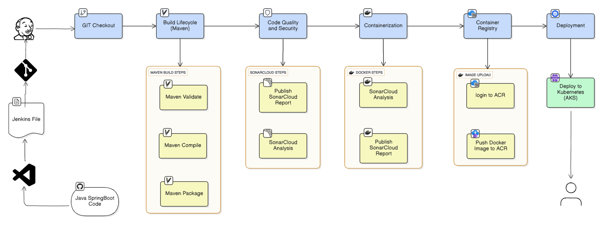
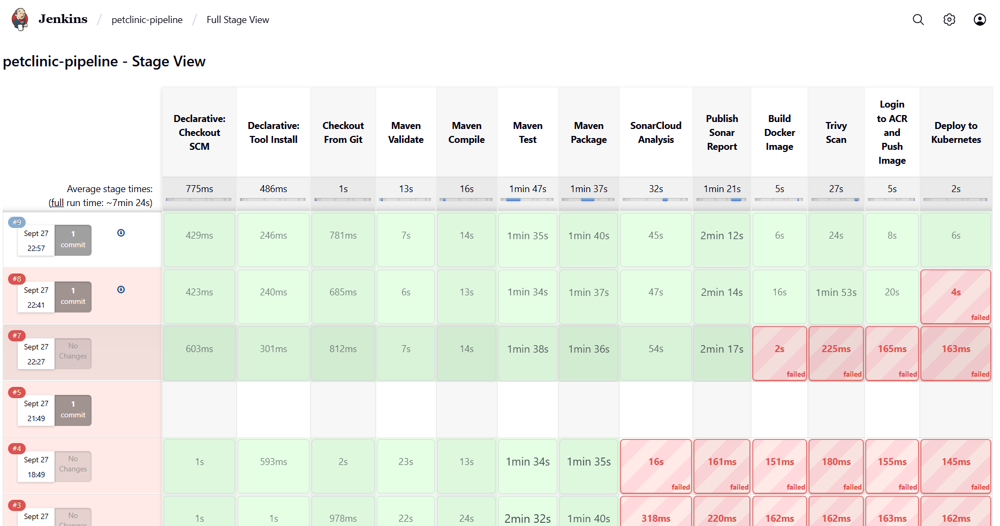
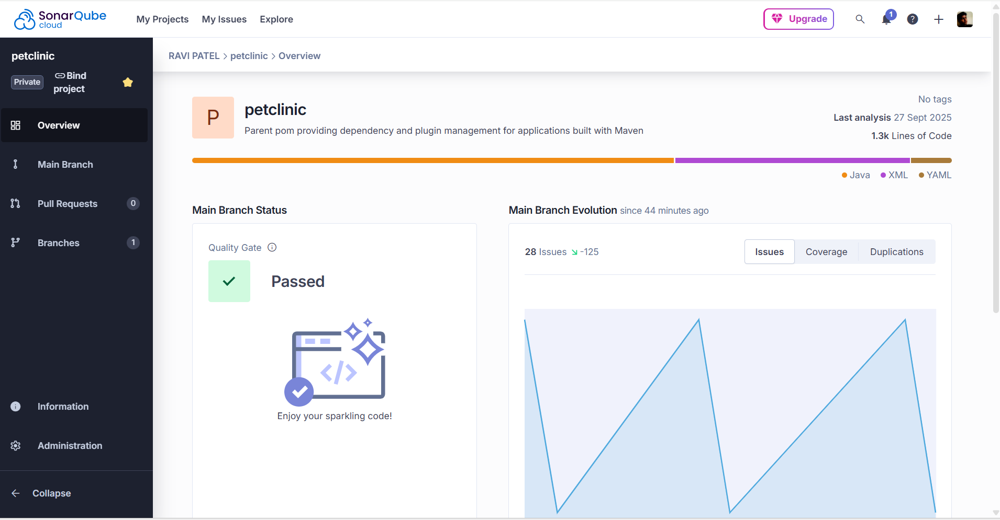
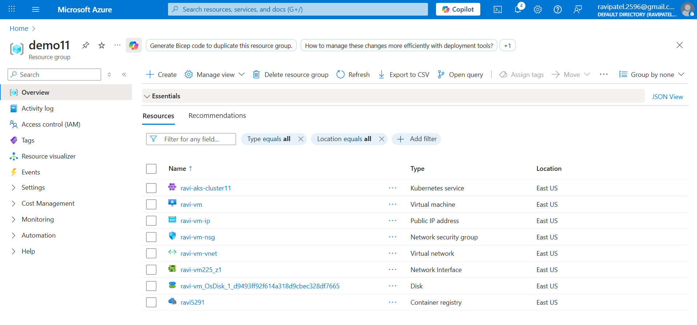
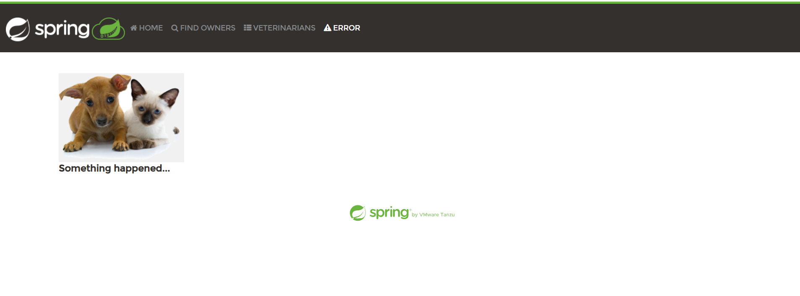

# Spring PetClinic CI/CD on Azure 

This repository documents how I built an **end-to-end CI/CD pipeline** for the Spring PetClinic app using **Jenkins → SonarCloud → Docker → Trivy → Azure Container Registry (ACR) → Azure Kubernetes Service (AKS)**.

>  **Source code is not included here** (this is a lightweight portfolio repo).  
> The pipeline was executed against a fork of the official project:  
> https://github.com/spring-projects/spring-petclinic

---

## Architecture

**Flow**  
1. Developer pushes to GitHub (forked PetClinic).  
2. Jenkins pipeline triggers: build, test, and analyze with SonarCloud.  
3. Docker image is built and scanned with Trivy.  
4. Image is pushed to **ACR**.  
5. Deployment applied to **AKS** using `kubectl`.  
6. Service exposed via **LoadBalancer** → public IP.

---

## Stack

- **Jenkins** (Pipeline as Code)
- **Maven** (Build, Test)
- **SonarCloud** (Code Quality/Security)
- **Docker** (Containerization)
- **Trivy** (Image Scan)
- **Azure**: ACR + AKS + Azure CLI
- **Kubernetes** (Deployment/Service)

---

## Credentials (in Jenkins)

Secrets are **not** stored in this repo. They live in **Jenkins → Credentials**:

| ID            | Type         | Purpose                           |
|---------------|--------------|-----------------------------------|
| `sonar-token` | Secret text  | SonarCloud token                  |
| `azure-sp`    | Username/Pwd | Azure Service Principal (appId/secret) |
| `azure-tenant`| Secret text  | Azure Tenant ID                   |

> These IDs are referenced by the Jenkinsfile. Values remain secure inside Jenkins.

---

## Screenshots

### Jenkins Pipeline

### SonarCloud Report

### Azure (ACR + AKS)

### Deployed App

---

## Pipeline Stages

1. **Checkout** branch from forked repo  
2. **Maven Validate/Compile/Test/Package**  
3. **SonarCloud Analysis** (scanner + maven plugin)  
4. **Build Docker** image  
5. **Trivy Scan** (HIGH/CRITICAL)  
6. **Login & Push** to ACR  
7. **Deploy to AKS** with `kubectl apply -f k8s/petclinic.yml`

- Spring PetClinic: https://github.com/spring-projects/spring-petclinic
- Trivy: https://github.com/aquasecurity/trivy
